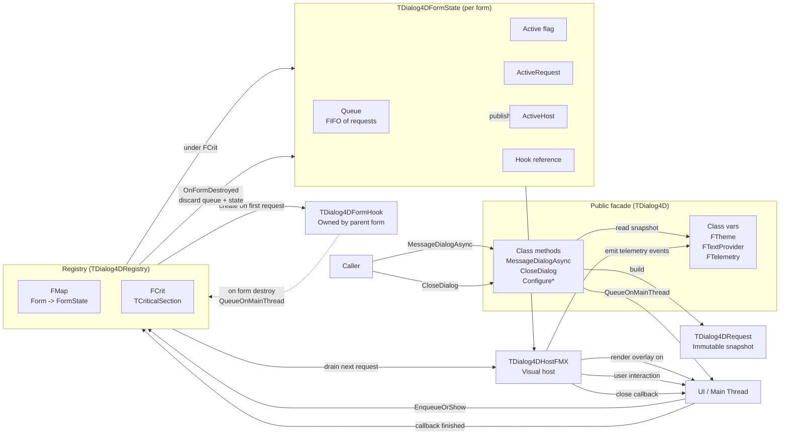
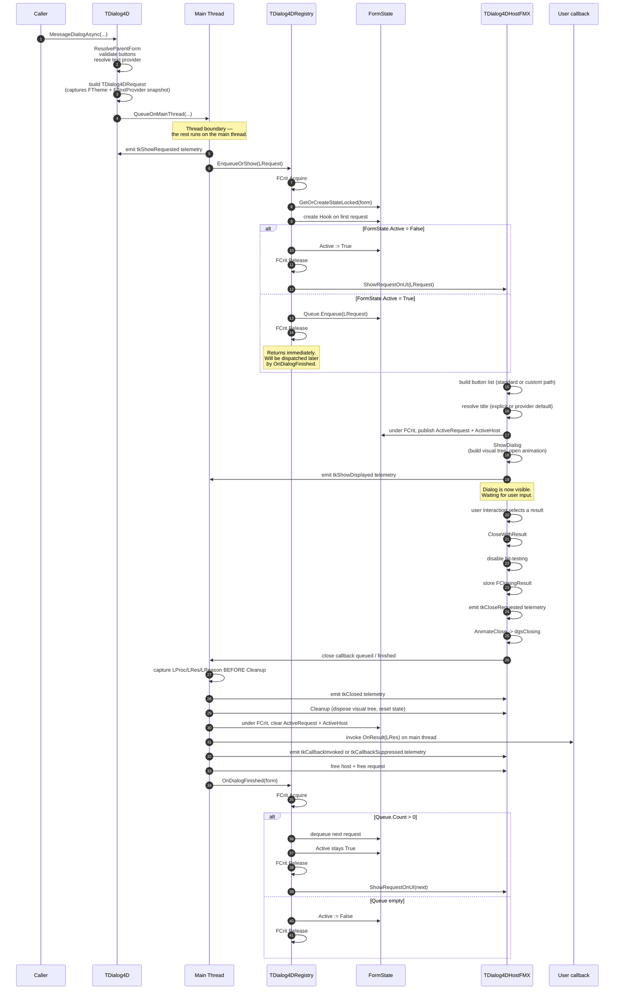
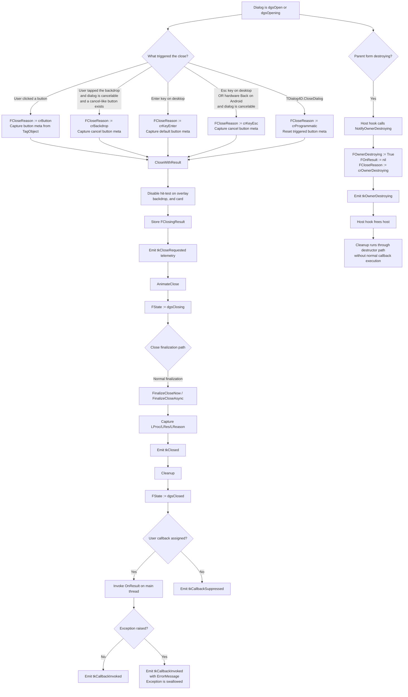
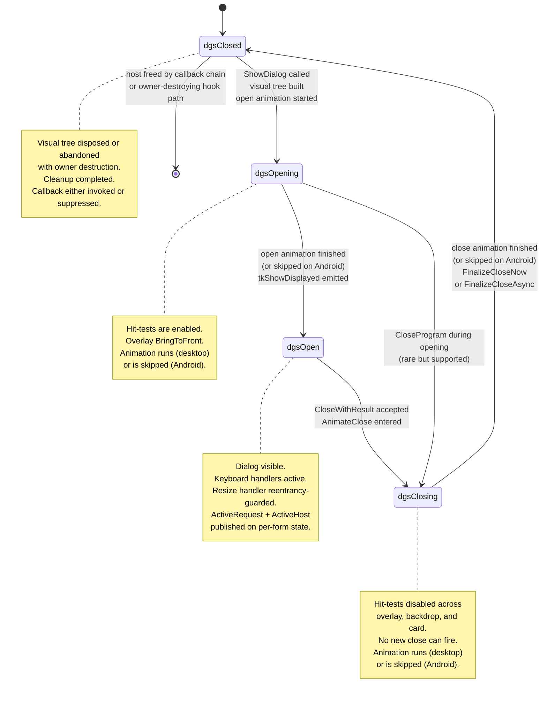
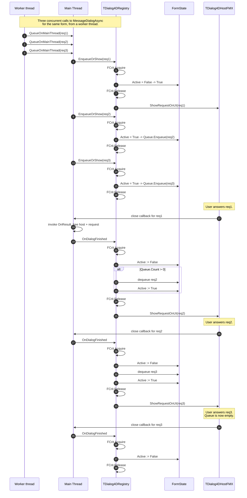
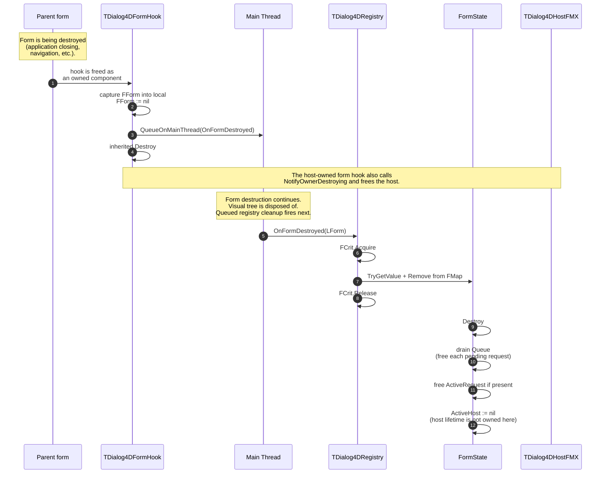
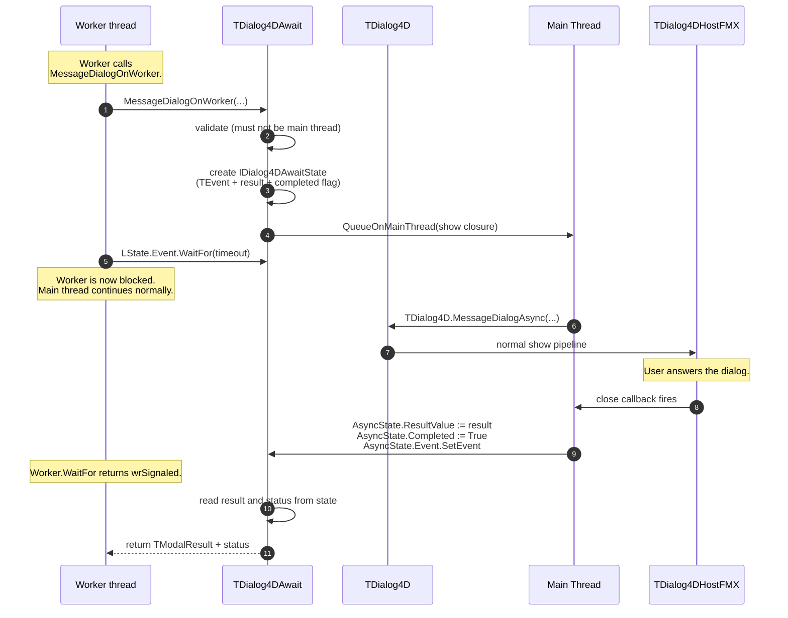

# Dialog4D Architecture

**Version:** 1.0.0

Dialog4D is not just an asynchronous wrapper around `FMX.DialogService`. It is a small execution machine with explicit roles, state transitions, publication rules, and lifecycle boundaries that govern how a dialog moves from a public API call to a visible overlay and back to a clean teardown.

This document complements the README by showing the mechanism as a whole: who owns what, which thread executes each step, how requests are queued and serialized per form, when configuration is captured, how close paths differ, and how form destruction is handled safely.

---

## 1. Architectural map



### Reading the map

- **Caller**: form, view model, or other owner that calls `TDialog4D.MessageDialogAsync` or `TDialog4D.CloseDialog`. The caller may be on any thread.
- **Public facade** (`TDialog4D`): receives requests, reads the global theme/provider snapshot, builds a `TDialog4DRequest`, and marshals work to the main thread. Holds three class vars (`FTheme`, `FTextProvider`, `FTelemetry`) — the global configuration surface.
- **Registry** (`TDialog4DRegistry`): process-wide singleton that maps each parent form to its `TDialog4DFormState`. Coordinates the per-form FIFO queue under a single `TCriticalSection`.
- **TDialog4DFormState**: per-form runtime state. Holds the FIFO queue of pending requests, the currently active request and host pointers, and a reference to the form hook.
- **TDialog4DRequest**: immutable snapshot built at call time. Captures every parameter — message, dialog type, buttons, callback, title, parent form, cancelable flag — plus a copy of the active theme and a reference to the active text provider.
- **Visual host** (`TDialog4DHostFMX`): one instance per visible dialog. Owns the FMX visual tree, the open/close animations, the input handlers, and the close pipeline. Created when a request is dispatched, destroyed after cleanup and callback processing complete.
- **Form hook** (`TDialog4DFormHook`): a `TComponent` owned by the parent form. Created lazily when the form's first request enters the registry. When the form is destroyed (and consequently its owned components), the hook's destructor schedules `OnFormDestroyed` on the main thread.
- **UI / Main Thread**: every visual operation, every user callback, and every state mutation on `FCrit`-protected fields runs here. Public API calls from worker threads are marshalled through `QueueOnMainThread` before any FMX work happens.

---

## 2. Main flow: from call to callback



### What this means

- `MessageDialogAsync` returns immediately. Even when called from the main thread, all visual work happens through `QueueOnMainThread` — this guarantees the call site never observes side effects from the dialog itself before the call returns.
- The thread boundary is crossed exactly once per request, in `Facade -> UI` via `QueueOnMainThread`. After that, the entire pipeline stays on the main thread.
- `tkShowRequested` is emitted **before** the registry decides whether to show or enqueue — so telemetry consumers can correlate the request with later `tkShowDisplayed` events even when there is queueing latency.
- The publication of `ActiveRequest` and `ActiveHost` on the per-form state is what makes `TDialog4D.CloseDialog` work: a concurrent close call snapshots the host pointer under the same `FCrit` and then invokes `CloseProgram` outside the lock.
- After the user callback runs, `OnDialogFinished` drains the next request from the FIFO. The `Active` flag is left `True` when there is a next request — this is intentional, so a concurrent `EnqueueOrShow` call goes straight to the queue rather than racing the dispatch.

### Cleanup ordering inside `FinalizeCloseNow`

There is a subtle invariant inside the close callback that is worth highlighting:

```text
1. Capture LProc, LRes, LReason
2. Emit tkClosed telemetry
3. Cleanup (resets FCloseReason and snapshot fields)
4. State := dgsClosed
5. Invoke user callback
6. Emit tkCallbackInvoked or tkCallbackSuppressed telemetry
```

The capture in step 1 must happen **before** Cleanup in step 3, because Cleanup resets `FCloseReason` and the snapshot fields to defaults. Without this capture-then-clean order, the user callback would receive a corrupted close reason and telemetry would lose context about why the dialog closed.

### Ordering at close start

`CloseWithResult` performs three immediate actions in this order:

1. disables hit-testing across the overlay, backdrop, and card;
2. stores `FClosingResult` and emits `tkCloseRequested`;
3. enters the close-animation path through `AnimateClose`.

The transition to `dgsClosing` happens inside `AnimateClose`, not before the `tkCloseRequested` emission. This ordering is intentional: the telemetry event records the close request at the point it is accepted, before animation-specific processing begins.

---

## 3. Alternate paths: how a dialog can close



### Contract by close path

- **`crButton`**: user clicked or tapped a button. The button rectangle's `TagObject` carries a `TDialog4DButtonMeta` instance, which is captured into the host before `CloseWithResult` runs. This is what allows telemetry to report the exact button kind, caption, and default flag.
- **`crBackdrop`**: user tapped the backdrop while the dialog is `ACancelable = True` and a cancel-like button exists. The triggered-button metadata is captured from the cancel button's index, so telemetry reports the cancel button as the responsible action even though the user did not click it directly.
- **`crKeyEnter`**: Enter key on Windows or macOS. Resolves to the first button with `IsDefault = True`, falling back to the first valid button if no explicit default is present.
- **`crKeyEsc`**: Esc key on desktop, or the hardware Back button on Android. Resolves to the first cancel-like button. On Android, the back key is always consumed (`Key := 0`) before the cancel branch, which prevents the OS from interpreting the event as activity-level navigation.
- **`crProgrammatic`**: `TDialog4D.CloseDialog` was called. The triggered-button metadata is reset because no button is responsible for this close.
- **Owner-destroying path**: this is not a normal `CloseWithResult` path. The host-owned form hook calls `NotifyOwnerDestroying`, which suppresses the user callback and emits `tkOwnerDestroying`, and then the hook frees the host. The guaranteed telemetry event for this scenario is `tkOwnerDestroying`. If a normal close pipeline was already in flight, additional close telemetry may already have been emitted as part of that pipeline.

### Why the user callback runs **after** Cleanup

The callback is invoked after the visual tree has been disposed of and `FState` has been set to `dgsClosed`. This is intentional: callbacks frequently start the next dialog, navigate to another screen, or destroy the parent form. Disposing of the visual tree first prevents the callback from interacting with a half-destroyed dialog. If the callback queues another dialog, that request enters the FIFO normally on the next main-thread cycle.

### Why callback exceptions are swallowed

If `OnResult` raises, the exception is swallowed and recorded in telemetry as `ErrorMessage` on the `tkCallbackInvoked` event. This is intentional: a faulty user callback must not leave the close pipeline in a partial state. The dialog has already been cleaned up by the time the callback runs, so there is nothing to roll back — the only safe action is to record the failure for diagnostics and continue.

---

## 4. State model



### Why hit-tests are disabled at close start

The first action of `CloseWithResult` is to set `HitTest := False` on the overlay, backdrop, and card. This closes the window where a user could trigger a second close mid-animation: any tap or click during the close animation hits the overlay but is ignored, so the dialog cannot enter `CloseWithResult` twice for the same instance.

Immediately after that, `CloseWithResult` stores `FClosingResult` and emits `tkCloseRequested`. The actual state transition to `dgsClosing` happens inside `AnimateClose`.

### Reentrancy guards

There are three reentrancy guards on the visual host:

- **`FFinalizing`** in `FinalizeCloseNow` — prevents a second pass even if a finish handler fires twice.
- **`FHandlingResize`** in `OverlayResized` — prevents recursion when `RecalcLayoutHeights` triggers another resize indirectly.
- **`FRebuildingButtons`** in `RebuildButtonsIfNeeded` — prevents a layout recalculation from triggering another button rebuild while one is already in flight.

These guards are flags, not locks. They run only on the main thread and protect against synchronous reentrancy from FMX layout callbacks.

### Android-specific state transitions

Two transitions behave differently on Android compared to desktop:

1. **Open animation is skipped.** `AnimateOpen` sets `FOverlay.Opacity := 1` directly and calls `OnOpenFinished(nil)` synchronously.
2. **Close finalization is deferred.** `OnCloseFinished` calls `FinalizeCloseAsync` instead of `FinalizeCloseNow`. The actual destruction is scheduled via `QueueOnMainThread` so the visual tree is not destroyed inline during touch or gesture processing.

---

## 5. Per-form FIFO queue flow



### Why the FIFO is per-form, not global

Each parent form has its own `TDialog4DFormState`, which means dialogs targeting different forms run in parallel. A request for Form A does not block a request for Form B. Within a single form, requests are strictly serialized in arrival order.

This matches user expectations in multi-window applications: a confirmation dialog on a child window does not freeze the main window's notifications, but two confirmations on the same window are presented one after the other.

### Lock discipline

The registry uses a single `TCriticalSection` (`FCrit`) to guard:

- the `FMap` dictionary itself,
- per-form `Active` flag,
- per-form `Queue`,
- per-form `ActiveRequest` and `ActiveHost` pointers.

The lock is held only for short atomic operations: dictionary lookup, queue enqueue/dequeue, pointer publication. Any FMX operation, any visual tree work, and any `Free` call happens **outside** the lock.

This lock-narrow-then-dispatch pattern appears in three places:

- `EnqueueOrShow` — decides under lock, calls `ShowRequestOnUI` outside.
- `OnDialogFinished` — decides under lock, calls `ShowRequestOnUI` outside.
- `CloseActiveDialog` — snapshots host pointer under lock, calls `CloseProgram` outside.

The reason is straightforward: calling user-facing FMX methods while holding a critical section risks deadlock if those methods queue work that ultimately needs the same lock to complete. A short, predictable lock window protects the data structure without holding the application hostage.

### Why `Active := True` stays during dispatch

When `OnDialogFinished` dequeues the next request, it sets `Active := True` again **before** releasing the lock. This is intentional: a concurrent `EnqueueOrShow` call that arrives during the dispatch must go straight to the queue, not race the dispatch. Without this, two requests could observe `Active = False` simultaneously and both attempt to start a dialog.

---

## 6. Form-destruction safety

Form destruction is the most subtle scenario in the framework, because it can happen at any moment relative to the dialog lifecycle:

- before any request was made;
- with a dialog visible and waiting for user input;
- with one dialog visible and others queued behind it;
- during the close animation;
- inside the user callback.

The mechanism handles all of these uniformly through the `TDialog4DFormHook` component owned by the parent form.



### Why the cleanup is deferred

The registry-facing form hook schedules `OnFormDestroyed` via `QueueOnMainThread` instead of running it inline. Reason: when the hook is freed, the parent form's visual tree is in the middle of being disposed of. Touching the registry inline could race with the form's own teardown. Deferring to the next main-thread cycle lets the form complete its visual cleanup first, then the registry processes the destruction in a clean state.

### Why `ActiveHost := nil` instead of freeing

The visual host's lifetime is not owned by `TDialog4DFormState`. The form state only publishes the active host pointer so `CloseDialog` can find it. On registry cleanup, setting `ActiveHost := nil` prevents future lookups from finding a stale pointer, but does not free the host itself.

The host is handled by the host-owned form hook, which calls `NotifyOwnerDestroying`, suppresses user callbacks, emits `tkOwnerDestroying`, and then frees the host through its own destruction path.

### What the application observes

From the application's perspective, form destruction is silent:

- pending requests for that form are discarded;
- the active dialog (if any) disappears together with the form's own visual teardown;
- no user callback fires;
- telemetry always emits `tkOwnerDestroying`.

Depending on the exact lifecycle moment, additional close telemetry may or may not already have been emitted by a close path that was in flight. The guaranteed event for this scenario is `tkOwnerDestroying`.

There is no error, no exception, and no "unblock" semantic for the application code. Form destruction is treated as a context-level cancellation of the dialog.

---

## 7. Worker-thread integration

`Dialog4D.Await` is **not** part of the core mechanism. It is a client built on top of `MessageDialogAsync` that adds a blocking wait for worker threads.



### Why `Dialog4D.Await` is a client, not a core feature

The await helper does not extend the core mechanism. It uses the same `MessageDialogAsync` path that any other caller would use, and it adds a single extra component: an `IDialog4DAwaitState` carrier that lets the worker thread wait on a `TEvent` while the main thread runs the dialog normally.

This design has two consequences:

1. **The await helper cannot be called from the main thread.** Doing so would deadlock — the thread that should render the dialog would be parked waiting for the result. `MessageDialogOnWorker` raises `EDialog4DAwait` immediately if called from the main thread.
2. **Timeout does not close the dialog.** When the timeout expires, the worker stops waiting and returns `dasTimedOut` with `mrNone`. The dialog stays on screen and remains visible to the user — the timeout only governs the worker's patience, not the dialog's lifetime. If the application wants to dismiss the dialog after a worker timeout, it can call `TDialog4D.CloseDialog` from the same worker.

### The smart `MessageDialog` overload

`TDialog4DAwait.MessageDialog` (without "OnWorker") is a convenience method that detects the calling thread:

- on the main thread, it delegates to `MessageDialogAsync` (non-blocking);
- on a worker thread, it delegates to `MessageDialogOnWorker` (blocking).

This lets shared code call `MessageDialog` regardless of the thread context. The `ACallbackOnMain` parameter, when `True`, additionally re-dispatches the user callback to the main thread via `QueueOnMainThread`, so the callback can touch UI directly without a manual `TThread.Queue` inside it.

---

## 8. Practical interpretation

The same actors from the architectural map can also be understood as four explicit roles:

1. **Caller / UI owner**  
   Configures global theme/provider/telemetry at startup, calls `MessageDialogAsync` whenever a decision is needed, optionally calls `CloseDialog` to dismiss the active dialog from any thread.

2. **Public facade** (`TDialog4D`)  
   Holds the global configuration as class vars. Builds immutable `TDialog4DRequest` snapshots, validates inputs, marshals to the main thread, and emits `tkShowRequested` telemetry.

3. **Registry** (`TDialog4DRegistry`)  
   Maps each parent form to its `TDialog4DFormState`. Serializes requests per form via a FIFO queue under a single `TCriticalSection`. Routes programmatic close calls to the active host. Detects form destruction through the form-owned hook and discards pending state.

4. **Visual host** (`TDialog4DHostFMX`)  
   One instance per visible dialog. Builds the FMX visual tree, runs the open and close animations, handles user input (button click, backdrop tap, Esc/Enter, Android Back), emits all per-instance telemetry, and runs the close pipeline including the deferred user callback.

If a developer understands those four roles, the whole mechanism becomes much easier to reason about.

### Note on snapshot semantics

The `TDialog4DRequest` built by `MessageDialogAsync` captures a copy of `FTheme` and a reference to `FTextProvider` at the moment of the call. Later changes to the global theme via `ConfigureTheme` do not affect requests already in flight — they render with the theme that existed when they were requested.

### Note on telemetry as observability

Every interesting transition emits a telemetry event:

- `tkShowRequested` — request entered the system.
- `tkShowDisplayed` — dialog became visible.
- `tkCloseRequested` — close was triggered.
- `tkClosed` — visual tree disposed.
- `tkCallbackInvoked` — user callback ran successfully (or raised, with `ErrorMessage`).
- `tkCallbackSuppressed` — callback was intentionally skipped.
- `tkOwnerDestroying` — parent form began destruction while the dialog was active.

Telemetry is best-effort: exceptions raised inside the sink are silently swallowed by `SafeEmitTelemetry`. A misbehaving telemetry consumer cannot break the dialog flow. This is the same guarantee that lets the framework safely emit telemetry in the close pipeline without risking partial-state recovery.

---

## 9. Reading guidance

Use the diagrams in this order:

1. **Architectural map** — see the parts and how the registry, the form hook, and the visual host fit together.
2. **Main flow** — see the normal path from `MessageDialogAsync` to the user callback, including the lock-narrow-then-dispatch discipline.
3. **Alternate paths** — see the different close reasons and how the user callback runs after Cleanup.
4. **State model** — understand the four host states and the role of the hit-test guard at close start.
5. **Per-form FIFO queue flow** — see how concurrent requests for the same form are serialized and why `Active` stays `True` during dispatch.
6. **Form-destruction safety** — understand the deferred registry cleanup pattern and the separate host owner-destroying path.
7. **Worker-thread integration** — understand why `Dialog4D.Await` is a client of the mechanism, not a part of it.
8. **Practical interpretation** — consolidate the four roles in your mental model.

That sequence makes the mechanism visible as a machine, not just as a list of API methods.

---

*This document complements the README by describing the mechanism from the inside. For project-level information, see [README.md](../README.md).*
